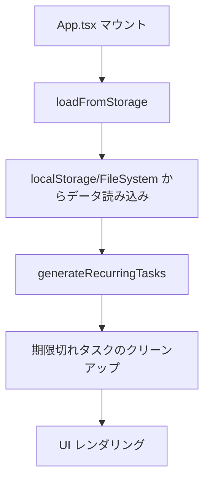
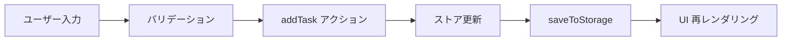
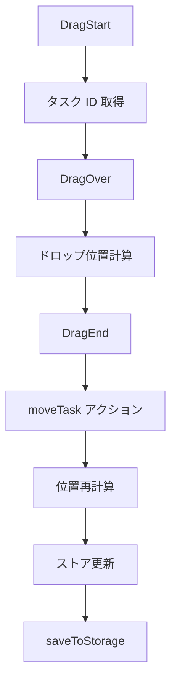

# アーキテクチャドキュメント

このドキュメントでは、Kanban Board アプリケーションのアーキテクチャと設計思想を説明します。

## 目次

- [技術スタック](#技術スタック)
- [プロジェクト構造](#プロジェクト構造)
- [状態管理](#状態管理)
- [データフロー](#データフロー)
- [パフォーマンス最適化](#パフォーマンス最適化)
- [デザインパターン](#デザインパターン)

---

## 技術スタック

### フロントエンド

#### コア技術
- **React 18.2**: UI ライブラリ
- **TypeScript 5.x**: 型安全な開発
- **Vite 5.x**: 高速ビルドツール

#### 状態管理
- **Zustand 4.x**: 軽量でシンプルな状態管理
  - Redux より少ない boilerplate
  - React Hooks ベースの API
  - DevTools サポート

#### UI コンポーネント
- **shadcn/ui**: ヘッドレス UI コンポーネント
  - Radix UI ベース
  - Tailwind CSS でスタイリング
  - カスタマイズ性が高い

- **Tailwind CSS 3.x**: ユーティリティファーストの CSS フレームワーク
  - Slack スタイルのカスタムテーマ
  - レスポンシブデザイン対応

#### ドラッグ&ドロップ
- **@dnd-kit 6.x**: モダンなドラッグ&ドロップライブラリ
  - アクセシビリティ対応
  - タッチデバイス対応
  - パフォーマンス最適化

#### フォームとバリデーション
- **React Hook Form**: パフォーマンスの高いフォーム管理
- **Zod**: TypeScript ファーストのスキーマバリデーション

#### 日付処理
- **date-fns 3.x**: 軽量な日付ライブラリ（日本語ロケール対応）
- **react-day-picker**: カレンダーコンポーネント

### バックエンド

#### デスクトップアプリ
- **Tauri 1.x**: Rust ベースのデスクトップフレームワーク
  - Electron より軽量（約 600KB）
  - セキュリティ重視の設計
  - ネイティブパフォーマンス

#### ストレージ
- **localStorage**: ブラウザ版
- **File System**: デスクトップ版（Tauri API）
- **JSON**: データシリアライゼーション

### 開発ツール

#### テスト
- **Vitest 2.x**: 高速ユニットテスト（346 テスト、カバレッジ 67%+）
- **Playwright 1.x**: E2E テスト（24 テスト）
- **Testing Library**: React コンポーネントテスト

#### コード品質
- **ESLint 9.x**: JavaScript/TypeScript リンター
- **TypeScript**: 厳格な型チェック（strict mode）
- **Prettier**: コードフォーマッター（推奨）

#### CI/CD
- **GitHub Actions**: 自動テスト、ビルド、リリース

---

## プロジェクト構造

```
kanban-rust/
├── src/                          # フロントエンドソース
│   ├── components/              # React コンポーネント
│   │   ├── board/              # ボード管理
│   │   ├── calendar/           # カレンダービュー
│   │   ├── filter/             # フィルター機能
│   │   ├── kanban/             # カンバンボード
│   │   ├── layout/             # レイアウトコンポーネント
│   │   ├── list/               # リストビュー
│   │   ├── member/             # メンバー管理
│   │   ├── search/             # 検索機能
│   │   ├── settings/           # 設定画面
│   │   ├── shared/             # 共有コンポーネント
│   │   ├── shortcuts/          # ショートカット
│   │   ├── tag/                # タグ管理
│   │   ├── task/               # タスク関連
│   │   └── ui/                 # shadcn/ui コンポーネント
│   ├── constants/              # 定数定義
│   │   ├── colors.ts           # カラーパレット
│   │   ├── priority.ts         # 優先度設定
│   │   └── validation.ts       # バリデーションルール
│   ├── hooks/                  # カスタムフック
│   │   ├── useDueDateNotifications.ts  # 通知機能
│   │   ├── useFilteredTasks.ts         # フィルター処理
│   │   ├── useKeyboardShortcuts.ts     # ショートカット
│   │   ├── useMediaQuery.ts            # レスポンシブ対応
│   │   └── useSwipe.ts                 # スワイプジェスチャー
│   ├── services/               # ビジネスロジック
│   │   ├── notification/       # 通知サービス
│   │   ├── recurrence/         # 繰り返しタスク
│   │   └── storage/            # ストレージ抽象化
│   ├── stores/                 # Zustand ストア
│   │   └── useBoardStore.ts    # メインストア
│   ├── types/                  # TypeScript 型定義
│   │   └── index.ts            # 共通型定義
│   ├── utils/                  # ユーティリティ関数
│   │   └── dueDate.ts          # 期限計算
│   ├── App.tsx                 # アプリケーションルート
│   └── main.tsx                # エントリーポイント
├── src-tauri/                   # Tauri バックエンド（Rust）
│   ├── src/
│   │   └── main.rs             # Tauri メインプロセス
│   ├── Cargo.toml              # Rust 依存関係
│   └── tauri.conf.json         # Tauri 設定
├── e2e/                        # E2E テスト
├── docs/                       # ドキュメント
├── public/                     # 静的アセット
└── tests/                      # テスト設定
```

---

## 状態管理

### Zustand ストアパターン

アプリケーションは単一の Zustand ストア（`src/stores/useBoardStore.ts`）で状態を管理します。

#### ストア構造

```typescript
interface BoardStoreState {
  // マルチボード対応
  boards: { [key: string]: Board };
  boardOrder: string[];
  currentBoardId: string;

  // グローバル設定（全ボード共通）
  members: { [key: string]: Member };
  notificationSettings: NotificationSettings;

  // UIステート
  filters: FilterState;
  searchQuery: string;
}
```

#### 重要な設計原則

1. **Single Source of Truth**
   - すべての状態はストアで管理
   - コンポーネントは状態を直接変更しない

2. **自動永続化**
   - 状態変更後に `saveToStorage()` を自動呼び出し
   - localStorage（ブラウザ版）またはファイルシステム（デスクトップ版）に保存

3. **セレクターパターン**
   ```typescript
   // 安定した参照を返すセレクター
   export const selectTasks = (state: BoardStoreState) => {
     const board = state.boards[state.currentBoardId];
     return board?.tasks ?? EMPTY_OBJECT;
   };
   ```

4. **パフォーマンス最適化**
   - `EMPTY_OBJECT` と `EMPTY_ARRAY` で参照の安定性を確保
   - 不要な再レンダリングを防止

### ストアアクション

#### タスク操作
- `addTask`: タスク作成
- `updateTask`: タスク更新
- `deleteTask`: タスク削除（物理削除）
- `softDeleteTask`: ゴミ箱に移動
- `moveTask`: タスク移動（列間、位置変更）

#### ボード操作
- `addBoard`: ボード作成
- `switchBoard`: ボード切り替え
- `deleteBoard`: ボード削除

#### フィルター操作
- `setFilters`: フィルター設定
- `clearFilters`: フィルタークリア

---

## データフロー

### アプリケーション起動フロー



### タスク作成フロー



### ドラッグ&ドロップフロー



---

## パフォーマンス最適化

### 実施済みの最適化

#### 1. React.memo によるコンポーネントメモ化
```typescript
export const FilterPanel = React.memo(() => {
  // props が変更されない限り再レンダリングをスキップ
});
```

**対象コンポーネント**:
- FilterPanel
- MemberManager
- TagManager
- CalendarView
- ListView
- TaskCard
- SortableTaskCard

#### 2. useCallback によるコールバックメモ化
```typescript
const handleAddNewTask = useCallback(() => {
  // 関数の再作成を防ぐ
}, [columnOrder, addTask]);
```

#### 3. useMemo による計算結果メモ化
```typescript
const membersList = useMemo(
  () => Object.values(members),
  [members]
);
```

#### 4. コード分割（Code Splitting）
```typescript
// 使用頻度が低いコンポーネントを lazy loading
const CalendarView = lazy(() => import("./components/calendar/CalendarView"));
```

**効果**:
- 初期バンドルサイズ削減
- 初回読み込み速度向上

#### 5. Zustand セレクター最適化
```typescript
// 安定した参照を返す
export const selectTasks = (state: BoardStoreState) => {
  const board = state.boards[state.currentBoardId];
  return board?.tasks ?? EMPTY_OBJECT;
};
```

### バンドルサイズ

```
dist/assets/index-BamGBkSZ.js         195.90 kB │ gzip: 53.24 kB
dist/assets/CalendarView-HaPBfY3l.js    6.04 kB │ gzip:  2.05 kB (lazy)
```

詳細は [PERFORMANCE_OPTIMIZATION.md](PERFORMANCE_OPTIMIZATION.md) を参照。

---

## デザインパターン

### 1. Container/Presentational Pattern

**Container コンポーネント** (ロジックを持つ):
```typescript
// KanbanBoard.tsx
const KanbanBoard = () => {
  const tasks = useBoardStore(selectTasks);
  const moveTask = useBoardStore((state) => state.moveTask);

  const handleDragEnd = (event) => {
    // ドラッグ&ドロップロジック
  };

  return <KanbanBoardView tasks={tasks} onDragEnd={handleDragEnd} />;
};
```

**Presentational コンポーネント** (UI のみ):
```typescript
// TaskCard.tsx
const TaskCard = React.memo(({ task, isDragging, onClick }) => {
  return (
    <Card onClick={onClick}>
      {/* UI のみ */}
    </Card>
  );
});
```

### 2. Custom Hooks Pattern

ロジックの再利用とコンポーネントの簡素化:

```typescript
// useFilteredTasks.ts
export function useFilteredTasks() {
  const tasks = useBoardStore(selectTasks);
  const filters = useBoardStore((state) => state.filters);
  const searchQuery = useBoardStore((state) => state.searchQuery);

  return useMemo(() => {
    return Object.values(tasks).filter((task) => {
      // フィルタリングロジック
    });
  }, [tasks, filters, searchQuery]);
}
```

### 3. Compound Component Pattern

関連するコンポーネントをグループ化:

```typescript
<Dialog>
  <DialogContent>
    <DialogHeader>
      <DialogTitle>タイトル</DialogTitle>
    </DialogHeader>
    <DialogFooter>
      <Button>保存</Button>
    </DialogFooter>
  </DialogContent>
</Dialog>
```

### 4. Higher-Order Component (HOC) Pattern

ドラッグ&ドロップの機能追加:

```typescript
// SortableTaskCard は TaskCard をラップ
const SortableTaskCard = ({ task }) => {
  const { attributes, listeners, setNodeRef } = useSortable({ id: task.id });

  return (
    <div ref={setNodeRef} {...attributes} {...listeners}>
      <TaskCard task={task} />
    </div>
  );
};
```

---

## セキュリティ

### データプライバシー

- すべてのデータはローカルに保存
- 外部サーバーとの通信なし
- トラッキング・分析ツールなし

### Tauri セキュリティ

- サンドボックス環境
- IPC（Inter-Process Communication）による安全な通信
- 必要最小限の権限のみ許可

---

## スケーラビリティ

### 将来の拡張性

#### 1. バックエンド統合
- **SharePoint 連携**: SyncMetadata 準備済み
- **REST API**: サービス層を API クライアントに置き換え

#### 2. 機能拡張
- **プラグインシステム**: 動的機能読み込み
- **カスタムテーマ**: CSS 変数ベースのテーマ切り替え

#### 3. パフォーマンス
- **仮想化**: 大量タスクの効率的レンダリング
- **Web Workers**: 重い計算処理の分離

---

## 参考資料

### 公式ドキュメント
- [React](https://react.dev/)
- [TypeScript](https://www.typescriptlang.org/)
- [Zustand](https://zustand-demo.pmnd.rs/)
- [Tauri](https://tauri.app/)
- [@dnd-kit](https://dndkit.com/)

### 設計パターン
- [React Patterns](https://reactpatterns.com/)
- [Clean Architecture](https://blog.cleancoder.com/uncle-bob/2012/08/13/the-clean-architecture.html)

### パフォーマンス
- [React Performance Optimization](https://react.dev/learn/render-and-commit#optimizing-performance)
- [Web Vitals](https://web.dev/vitals/)
